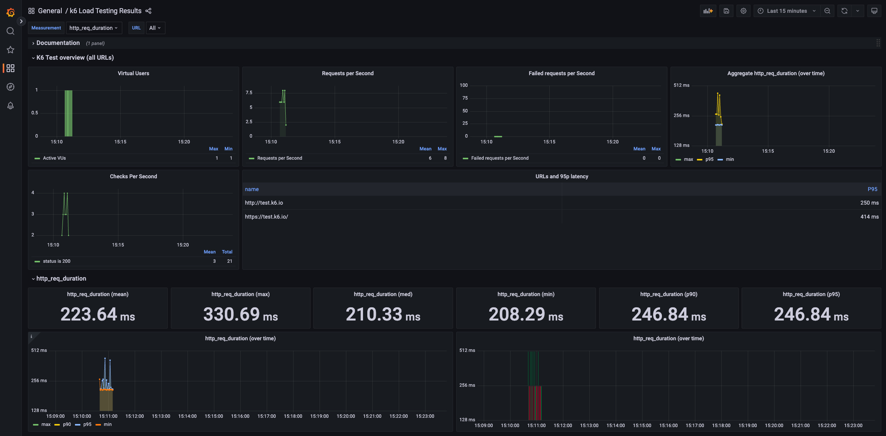

# Simple K6

Grafana Dashboard: https://grafana.com/grafana/dashboards/4411-k6-load-testing-results/



Ports:
- 8080: UI
- 3000: Grafana
- 5665: K6 Status, only work when k6 script is running

Note:
- K6 Report will save under `reports` directory. 

## Dependency

- Git
- Docker
- Docker Compose

## Usage

```bash
git clone https://github.com/timfanda35/simple-k6.git 
cd simple-k6

make docker-build
docker compose up -d
```
